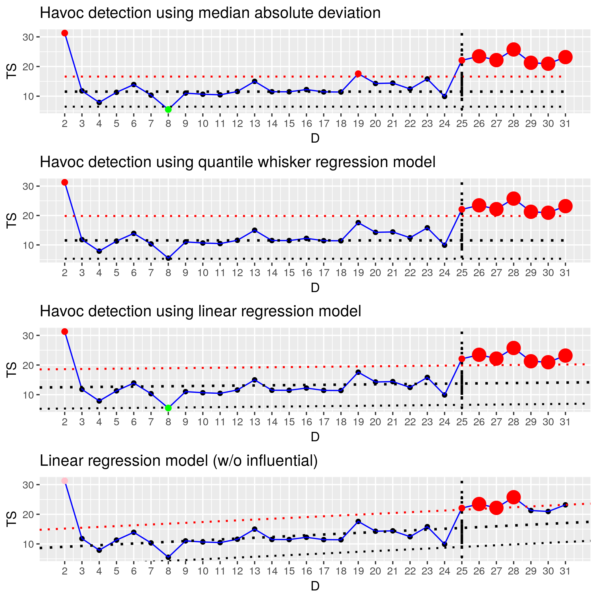

# About

This project is about reaserch and implemention on strategies  to find statstical outliers.

## List of function implmented
- quantile_
-  rank_
-  median_
-  mad_
-  double_mad_
-  lm_ // Implementation of R's lm function
-  find_outliers_double_mad_based_
-  train_n_test_type_1 // Find outlier based on mad
-  quantile_iqr_statistics_
-  train_n_test_type_2 // Find outlier based on IQR
-  train_n_test_type_3  // Find outlier based on linear reggression w/o removing influentials
-  hatvalues_
-  find_leverage_
-  find_influence_cooks_
-  find_influence_dffits_
-  train_n_test_type_4 // Find outlier based on linear reggression removing influentials
-  control_charts_statistics_
-  train_n_test_type_5 // Find outlier based on control charts
-  quantile_regression_statistics_
-  train_n_test_type_6 // Find outlier based on quantile regression based
-  train_n_test_type_6_1 # // Find outlier based on quantile regression with cutoff decided by .9 and .1 quantile regression line
-  gesd_statistics_
-  train_n_test_type_7 // Find outlier based on quantile regression based on gesd statistics
-  cusum_statistics_ // [link](http://www.variation.com/cpa/tech/changepoint.html)
    -  changepoint_analysis_
    -  train_n_test_type_8 // Find outlier based on cusum statistics

## Usage
```
source ("driver.R")

```

## Visualization

An example vizuatizaion produced by the script coparing 4 ourlier detection strategies.

